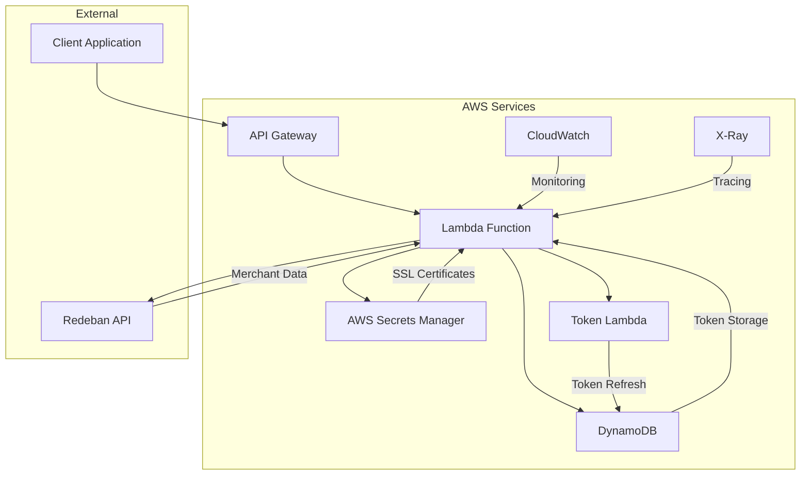

# 🏦 Redeban KYC Commerce Lookup Service

[](https://aws.amazon.com/lambda/)
[](https://python.org)
[](https://aws.amazon.com/serverless/sam/)
[](LICENSE)

A robust, enterprise-grade serverless application for querying merchant information through Redeban's KYC (Know Your Customer) API. Built with AWS Lambda, this service provides secure, scalable, and highly available merchant data retrieval with comprehensive monitoring and observability.

## 🎯 Overview

The Redeban KYC Commerce Lookup Service is a production-ready serverless solution that:

- ✅ **Securely authenticates** with Redeban API using SSL client certificates
- ✅ **Manages authentication tokens** with automatic refresh and caching
- ✅ **Provides standardized APIs** for merchant information retrieval
- ✅ **Implements enterprise patterns** including retry logic, circuit breakers, and comprehensive logging
- ✅ **Ensures high availability** with multi-AZ deployment and automatic failover
- ✅ **Maintains security** with least-privilege IAM policies and encrypted data storage

## 🏗️ Architecture



### Core Components

| Component | Purpose | Technology |
|-----------|---------|------------|
| **API Gateway** | REST API endpoint with request validation | AWS API Gateway |
| **Lambda Function** | Main application logic and orchestration | Python 3.10 |
| **DynamoDB** | Token storage with TTL-based expiration | AWS DynamoDB |
| **Secrets Manager** | Secure SSL certificate storage | AWS Secrets Manager |
| **CloudWatch** | Comprehensive logging and monitoring | AWS CloudWatch |
| **X-Ray** | Distributed tracing and performance analysis | AWS X-Ray |

## 🚀 Quick Start

### Prerequisites

- **AWS CLI** v2.0+ configured with appropriate credentials
- **SAM CLI** v1.50+ for serverless deployment
- **Python** 3.10+ for local development and testing
- **Docker** (optional) for containerized builds

### Environment Setup

1. **Clone the repository**
   ```bash
   git clone https://github.com/Efrain290493/gft
   cd redeban-kyc-lambda
   ```

2. **Configure AWS credentials**
   ```bash
   aws configure
   # OR use environment variables
   export AWS_ACCESS_KEY_ID=your-access-key
   export AWS_SECRET_ACCESS_KEY=your-secret-key
   export AWS_DEFAULT_REGION=us-east-1
   ```

3. **Install dependencies**
   ```bash
   pip install -r requirements.txt
   ```

### AWS Resources Setup

#### 1. Create Secrets Manager Resources

```bash
# Create certificate secret
aws secretsmanager create-secret \
    --name "Redeban_Obtener_Token" \
    --description "SSL certificates for Redeban API authentication" \
    --secret-string '{
        "redeban_crt": "<base64_encoded_certificate>",
        "redeban_key": "<base64_encoded_private_key>"
    }'

# Create client configuration secret
aws secretsmanager create-secret \
    --name "Client_secrets_Rdb" \
    --description "Client configuration for Redeban integration" \
    --secret-string '{
        "client_id": "your-client-id",
        "additional_config": "value"
    }'
```

#### 2. Deploy the Application

```bash
# Make deployment script executable
chmod +x scripts/deploy.sh

# Deploy to development environment
./scripts/deploy.sh dev us-east-1

# Deploy to production environment
./scripts/deploy.sh prod us-east-1
```

#### 3. Verify Deployment

```bash
# Get API endpoint URL
API_URL=$(aws cloudformation describe-stacks \
    --stack-name redeban-kyc-dev \
    --query 'Stacks[0].Outputs[?OutputKey==`ApiUrl`].OutputValue' \
    --output text)

# Test the API
curl -X GET "${API_URL}/commerce/10203040" \
    -H "Content-Type: application/json"
```

## 📁 Project Structure

```
redeban-kyc-lambda/
├── 📄 template.yaml              # SAM infrastructure template
├── 📄 samconfig.toml             # SAM configuration
├── 📄 requirements.txt           # Python dependencies
├── 📄 README.md                  # This documentation
├── 📄 .gitignore                 # Git ignore rules
├── 📄 pyproject.toml             # Python project configuration
│
├── 📂 src/                       # Source code
│   ├── 📄 app.py                 # Main Lambda handler
│   ├── 📂 services/              # Business logic services
│   │   ├── 📄 __init__.py
│   │   ├── 📄 aws_service.py     # AWS services integration
│   │   └── 📄 redeban_service.py # Redeban API client
│   ├── 📂 models/                # Data models and schemas
│   │   ├── 📄 __init__.py
│   │   └── 📄 responses.py       # Response formatting
│   └── 📂 utils/                 # Utility modules
│       ├── 📄 __init__.py
│       └── 📄 logger.py          # Logging configuration
│
├── 📂 tests/                     # Test suite
│   ├── 📄 __init__.py
│   ├── 📂 unit/                  # Unit tests
│   │   ├── 📄 __init__.py
│   │   ├── 📄 test_app.py
│   │   ├── 📄 test_aws_service.py
│   │   └── 📄 test_redeban_service.py
│   ├── 📂 integration/           # Integration tests
│   │   ├── 📄 __init__.py
│   │   └── 📄 test_api_integration.py
│   └── 📂 fixtures/              # Test data
│       └── 📄 sample_responses.json
│
├── 📂 scripts/                   # Deployment and utility scripts
│   ├── 📄 deploy.sh              # Deployment automation
│   ├── 📄 test_local.py          # Local testing utility
│   └── 📄 cleanup.sh             # Resource cleanup
│
├── 📂 docs/                      # Additional documentation
│   ├── 📄 API.md                 # API documentation
│   ├── 📄 DEPLOYMENT.md          # Deployment guide
│   └── 📄 TROUBLESHOOTING.md     # Common issues and solutions
│
└── 📂 events/                    # Sample event payloads
    ├── 📄 api_gateway_event.json
    └── 📄 direct_invoke_event.json
```

## 🔧 Configuration

### Environment Variables

| Variable | Description | Default | Required |
|----------|-------------|---------|----------|
| `AWS_REGION` | AWS region for deployment | `us-east-1` | Yes |
| `ENVIRONMENT` | Deployment environment | `dev` | Yes |
| `LOG_LEVEL` | Logging level | `INFO` | No |
| `DYNAMODB_TABLE` | DynamoDB table name | `RedebanTokens` | Yes |
| `SECRET_NAME` | Certificate secret name | `Redeban_Obtener_Token` | Yes |
| `CLIENT_SECRET_NAME` | Client config secret name | `Client_secrets_Rdb` | Yes |
| `TOKEN_LAMBDA_NAME` | Token retrieval Lambda name | `lambda_function_obtener_token` | Yes |
| `REDEBAN_BASE_URL` | Redeban API base URL | `https://api.qa.sandboxhubredeban.com:9445` | Yes |
| `REDEBAN_API_PATH` | API path prefix | `/rbmcalidad/calidad/api/kyc/v3.0.0/enterprise` | Yes |
| `REDEBAN_TIMEOUT` | API request timeout (seconds) | `30` | No |
| `REDEBAN_MAX_RETRIES` | Maximum retry attempts | `3` | No |

### Environment-Specific Configuration

#### Development (`dev`)
```yaml
LOG_LEVEL: DEBUG
REDEBAN_TIMEOUT: 60
ENABLE_DETAILED_LOGGING: true
```

#### Staging (`staging`)
```yaml
LOG_LEVEL: INFO
REDEBAN_TIMEOUT: 30
ENABLE_PERFORMANCE_MONITORING: true
```

#### Production (`prod`)
```yaml
LOG_LEVEL: WARNING
REDEBAN_TIMEOUT: 20
ENABLE_ALERTING: true
RESERVED_CONCURRENCY: 100
```

## 📚 API Documentation

### Base URL
```
https://{api-id}.execute-api.{region}.amazonaws.com/{stage}
```

### Endpoints

#### `GET /commerce/{merchantId}`

Retrieve merchant information by ID.

**Parameters:**
- `merchantId` (path, required): 8-digit merchant identifier
- `includeRawData` (query, optional): Include raw API response (`true`/`false`)

**Request Example:**
```bash
curl -X GET "https://api.example.com/dev/commerce/10203040?includeRawData=true" \
     -H "Content-Type: application/json" \
     -H "Accept: application/json"
```

**Success Response (200):**
```json
{
  "success": true,
  "data": {
    "merchant_id": "10203040",
    "business_info": {
      "business_name": "Example Commerce Ltd",
      "status": "ACTIVE",
      "is_active": true,
      "registration_date": "2023-01-15T10:30:00Z"
    },
    "contact_info": {
      "email": "contact@example.com",
      "phone": "+1234567890",
      "address": "123 Business St, City, State"
    },
    "additional_info": {
      "document_number": "123456789",
      "economic_activity": "E-commerce",
      "establishment_info": {
        "type": "MAIN_OFFICE",
        "employees": 50
      }
    },
    "raw_api_response": {
      "businessName": "Example Commerce Ltd",
      "status": "ACTIVE",
      "registrationDate": "2023-01-15T10:30:00Z"
    },
    "response_timestamp": "2024-01-15T10:30:00Z"
  },
  "metadata": {
    "timestamp": "2024-01-15T10:30:00Z",
    "response_id": "550e8400-e29b-41d4-a716-446655440000",
    "version": "1.0"
  }
}
```

**Error Responses:**

| Status | Error Type | Description |
|--------|------------|-------------|
| 400 | `VALIDATION_ERROR` | Invalid merchant ID format |
| 401 | `AUTHENTICATION_ERROR` | Invalid or expired token |
| 403 | `AUTHORIZATION_ERROR` | Insufficient permissions |
| 404 | `RESOURCE_NOT_FOUND` | Merchant not found |
| 429 | `RATE_LIMIT_ERROR` | Too many requests |
| 500 | `INTERNAL_SERVER_ERROR` | Server error |

**Error Response Example:**
```json
{
  "success": false,
  "error": {
    "type": "VALIDATION_ERROR",
    "message": "MerchantID must be exactly 8 numeric digits",
    "code": 400,
    "details": {
      "field": "merchantId",
      "provided_value": "invalid123"
    }
  },
  "metadata": {
    "timestamp": "2024-01-15T10:30:00Z",
    "response_id": "550e8400-e29b-41d4-a716-446655440000",
    "version": "1.0"
  }
}
```

#### `GET /health`

Health check endpoint for monitoring.

**Response (200):**
```json
{
  "success": true,
  "data": {
    "status": "healthy",
    "timestamp": "2024-01-15T10:30:00Z",
    "services": {
      "lambda": "healthy",
      "aws_services": {
        "dynamodb": "healthy",
        "secrets_manager": "healthy"
      },
      "external_services": {
        "redeban_api": {
          "status": "healthy",
          "response_time_ms": 150
        }
      }
    },
    "version": "1.0"
  }
}
```

## 🧪 Testing

### Unit Tests

```bash
# Install test dependencies
pip install pytest pytest-cov pytest-mock

# Run all tests
pytest tests/ -v

# Run with coverage report
pytest tests/ --cov=src --cov-report=html --cov-report=term

# Run specific test file
pytest tests/unit/test_app.py -v

# Run specific test method
pytest tests/unit/test_app.py::TestLambdaHandler::test_successful_execution -v
```

### Integration Tests

```bash
# Run integration tests (requires AWS credentials)
pytest tests/integration/ -v

# Run with specific environment
ENVIRONMENT=staging pytest tests/integration/ -v
```

### Local Testing

```bash
# Run comprehensive local tests
python scripts/test_local.py

# Run specific test scenario
python scripts/test_local.py --test api_gateway

# Interactive testing mode
python scripts/test_local.py --interactive

# List available test scenarios
python scripts/test_local.py --list
```

### SAM Local Testing

```bash
# Invoke function locally
sam local invoke RedebanCommerceFunction -e events/api_gateway_event.json

# Start local API server
sam local start-api --port 3000

# Test local API
curl "http://localhost:3000/commerce/10203040"
```

## 📊 Monitoring and Observability

### CloudWatch Metrics

The application automatically publishes custom metrics:

- **Business Metrics:**
  - `MerchantLookups.Success`
  - `MerchantLookups.Errors`
  - `MerchantLookups.Duration`
  - `TokenRefresh.Count`

- **Technical Metrics:**
  - `Lambda.Duration`
  - `Lambda.Errors`
  - `Lambda.Throttles`
  - `API.4xxErrors`
  - `API.5xxErrors`

### CloudWatch Alarms

Pre-configured alarms for monitoring:

```yaml
# High Error Rate
ErrorRateAlarm:
  MetricName: Errors
  Threshold: 5
  ComparisonOperator: GreaterThanThreshold
  EvaluationPeriods: 2
  Period: 300

# High Duration
DurationAlarm:
  MetricName: Duration
  Threshold: 25000  # 25 seconds
  ComparisonOperator: GreaterThanThreshold
  EvaluationPeriods: 3
  Period: 300

# API Gateway 4xx Errors
APIClientErrorAlarm:
  MetricName: 4XXError
  Threshold: 10
  ComparisonOperator: GreaterThanThreshold
  EvaluationPeriods: 2
  Period: 300
```

### Logging

The application uses structured JSON logging optimized for CloudWatch:

```bash
# View logs in real-time
sam logs -n RedebanCommerceFunction --stack-name redeban-kyc-dev --tail

# View logs with filter
aws logs filter-log-events \
    --log-group-name "/aws/lambda/redeban-commerce-lookup-dev" \
    --filter-pattern "ERROR" \
    --start-time $(date -d '1 hour ago' +%s)000

# View performance logs
aws logs filter-log-events \
    --log-group-name "/aws/lambda/redeban-commerce-lookup-dev" \
    --filter-pattern "{ $.execution_time_ms > 5000 }" \
    --start-time $(date -d '1 hour ago' +%s)000
```

### X-Ray Tracing

Enable X-Ray tracing for detailed performance analysis:

```yaml
# In template.yaml
Globals:
  Function:
    Tracing: Active
```

## 🔒 Security

### IAM Permissions

The Lambda function uses least-privilege IAM policies:

```json
{
  "Version": "2012-10-17",
  "Statement": [
    {
      "Effect": "Allow",
      "Action": [
        "dynamodb:GetItem",
        "dynamodb:PutItem",
        "dynamodb:UpdateItem"
      ],
      "Resource": "arn:aws:dynamodb:*:*:table/RedebanTokens"
    },
    {
      "Effect": "Allow",
      "Action": [
        "secretsmanager:GetSecretValue"
      ],
      "Resource": "arn:aws:secretsmanager:*:*:secret:Redeban_Obtener_Token*"
    },
    {
      "Effect": "Allow",
      "Action": [
        "lambda:InvokeFunction"
      ],
      "Resource": "arn:aws:lambda:*:*:function:lambda_function_obtener_token"
    }
  ]
}
```

### Data Protection

- **Encryption at Rest:** All data stored in DynamoDB and Secrets Manager is encrypted
- **Encryption in Transit:** All API communications use TLS 1.2+
- **Certificate Security:** SSL certificates stored securely in Secrets Manager
- **Token Security:** Authentication tokens cached with automatic expiration
- **Log Security:** Sensitive data automatically redacted from logs

### Network Security

- **VPC Configuration:** Optional VPC deployment for enhanced network isolation
- **Security Groups:** Restrictive security groups for Lambda functions
- **API Gateway:** Request validation and rate limiting
- **CORS Configuration:** Properly configured CORS headers

## ⚡ Performance Optimization

### Lambda Configuration

```yaml
# Optimized Lambda settings
Memory: 1024MB          # Balance between cost and performance
Timeout: 30s            # Sufficient for API calls with retries
ReservedConcurrency: 100 # Prevent runaway scaling
```

### Cold Start Optimization

- **Provisioned Concurrency:** Available for production workloads
- **Connection Reuse:** HTTP connections reused across invocations
- **Dependency Optimization:** Minimal dependencies to reduce package size
- **Initialization Caching:** Services initialized outside handler

### Performance Metrics

- **Cold Start:** ~800ms (first invocation)
- **Warm Start:** ~200ms (subsequent invocations)
- **Average Duration:** ~1.5s (complete merchant lookup)
- **Memory Usage:** ~200MB of 1024MB allocated

## 🚨 Troubleshooting

### Common Issues

#### 1. **Certificate Issues**
```bash
# Check certificate secret
aws secretsmanager get-secret-value --secret-id Redeban_Obtener_Token

# Verify certificate format
echo "<base64_cert>" | base64 -d | openssl x509 -text -noout
```

#### 2. **Token Issues**
```bash
# Check DynamoDB table
aws dynamodb scan --table-name RedebanTokens

# Verify token Lambda
aws lambda get-function --function-name lambda_function_obtener_token

# Test token Lambda
aws lambda invoke --function-name lambda_function_obtener_token /tmp/response.json
```

#### 3. **API Connectivity**
```bash
# Test API endpoint
curl -k -v "https://api.qa.sandboxhubredeban.com:9445/rbmcalidad/calidad/api/kyc/v3.0.0/enterprise"

# Check DNS resolution
nslookup api.qa.sandboxhubredeban.com

# Verify SSL certificate
openssl s_client -connect api.qa.sandboxhubredeban.com:9445 -servername api.qa.sandboxhubredeban.com
```

#### 4. **Performance Issues**
```bash
# Enable X-Ray tracing
aws lambda put-function-configuration \
    --function-name redeban-commerce-lookup-prod \
    --tracing-config Mode=Active

# Monitor CloudWatch metrics
aws cloudwatch get-metric-statistics \
    --namespace AWS/Lambda \
    --metric-name Duration \
    --dimensions Name=FunctionName,Value=redeban-commerce-lookup-prod \
    --start-time $(date -d '1 hour ago' -u +%Y-%m-%dT%H:%M:%S) \
    --end-time $(date -u +%Y-%m-%dT%H:%M:%S) \
    --period 300 \
    --statistics Average,Maximum
```

### Debug Mode

Enable debug logging for detailed troubleshooting:

```bash
# Set debug log level
aws lambda update-function-configuration \
    --function-name redeban-commerce-lookup-dev \
    --environment Variables='{LOG_LEVEL=DEBUG}'
```

## 💰 Cost Optimization

### Estimated Monthly Costs

| Component | Usage | Cost (USD) |
|-----------|--------|------------|
| Lambda (1000 requests/day) | 30K requests, 2s avg | $2.50 |
| API Gateway | 30K requests | $3.50 |
| DynamoDB (on-demand) | 30K reads/writes | $0.25 |
| CloudWatch Logs | 10GB logs | $0.50 |
| Secrets Manager | 2 secrets | $0.80 |
| **Total** | | **$7.55** |

### Cost Optimization Strategies

1. **Lambda Optimization:**
   - Use ARM-based Graviton2 processors (20% cost savings)
   - Optimize memory allocation based on profiling
   - Implement efficient caching strategies

2. **Storage Optimization:**
   - Set appropriate CloudWatch log retention periods
   - Use DynamoDB on-demand pricing for variable workloads
   - Implement log compression for high-volume scenarios

3. **API Gateway Optimization:**
   - Consider HTTP API instead of REST API for simple use cases
   - Implement caching for frequently accessed data
   - Use regional endpoints to reduce data transfer costs

## 🤝 Contributing

### Development Workflow

1. **Fork and Clone**
   ```bash
   git clone https://github.com/your-username/redeban-kyc-lambda.git
   cd redeban-kyc-lambda
   ```

2. **Create Feature Branch**
   ```bash
   git checkout -b feature/your-feature-name
   ```

3. **Development Setup**
   ```bash
   # Install dependencies
   pip install -r requirements.txt
   pip install -r requirements-dev.txt
   
   # Set up pre-commit hooks
   pre-commit install
   ```

4. **Code Quality**
   ```bash
   # Format code
   black src/ tests/
   
   # Lint code
   flake8 src/ tests/
   
   # Type checking
   mypy src/
   
   # Run tests
   pytest tests/ --cov=src
   ```

5. **Commit and Push**
   ```bash
   git add .
   git commit -m "feat: add new feature"
   git push origin feature/your-feature-name
   ```

6. **Create Pull Request**
   - Use the provided PR template
   - Include tests for new features
   - Update documentation as needed

### Code Standards

- **Python:** Follow PEP 8 with Black formatting
- **Docstrings:** Use Google-style docstrings
- **Type Hints:** Use type hints for all public functions
- **Testing:** Maintain >90% code coverage
- **Security:** No hardcoded secrets or credentials

### Commit Convention

```
feat: add new feature
fix: fix bug in existing feature
docs: update documentation
test: add or update tests
refactor: refactor code without changing functionality
perf: improve performance
ci: update CI/CD configuration
```

## 📄 License

This project is licensed under the MIT License - see the [LICENSE](LICENSE) file for details.

## 📞 Support

### Resources

- **Documentation:** [Wiki](https://github.com/your-org/redeban-kyc-lambda/wiki)
- **Issue Tracker:** [GitHub Issues](https://github.com/your-org/redeban-kyc-lambda/issues)
- **Security Issues:** [Security Policy](SECURITY.md)

### Contact

- **Team:** DevSecOps Engineering
- **Email:** devsecops@gft.com
- **Slack:** #redeban-kyc-support

### Service Level Agreement

- **Uptime:** 99.9% availability
- **Response Time:** <2 seconds (95th percentile)
- **Support Response:** <4 hours during business hours

---

**Built with ❤️ by the DevSecOps Team using AWS Lambda, Python, and SAM**